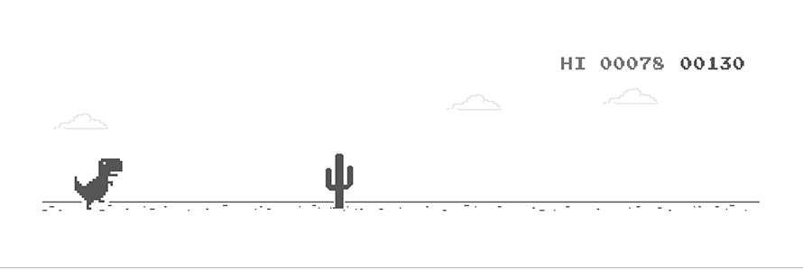

## Hi there 👋

I'm Sai Satwik Bikumandla!

<h1 align="center"><a target="_blank" href="https://rococo-horse-a3ea9b.netlify.app/">Click to Visit My Portfolio Page</a></h1>

 
  Visitor count 
  

- 🔭 I’m currently working on exciting software projects and exploring new technologies.
- 🌱 I’m currently learning advanced JavaScript, Python and Machine Learning Concepts.
- 👯 I’m looking to collaborate on open-source projects and innovative tech solutions.
- 🤔 I’m looking for help with large-scale distributed systems.
- 💬 Ask me about web development, backend engineering, or anything tech!
- 📫 How to reach me: [saisatwikbikumandla9@gmail.com](mailto:saisatwikbikumandla9@gmail.com)
- 😄 Pronouns: he/him
- ⚡ Fun fact: I love solving puzzles and participating in hackathons!

---

### 👨‍💻 About Me

A Software Engineer skilled in JavaScript, React, Node.js, Python and Machine Learning concepts for building scalable web apps, with expertise in AWS, MongoDB/MySQL, Git/GitHub, and Selenium for end-to-end software development.

---

### 🧰 Skills

- **Languages:** C++, Java, JavaScript, Python, SQL
- **Web:** CSS, HTML/DOM, REST APIs
- **Frameworks/Libraries:** Express.js, Node.js, React
- **Version Control:** Git, GitHub
- **Database:** MongoDB, MySQL
- **Cloud:** AWS
- **Testing:** Selenium

---

](dino.gif)
